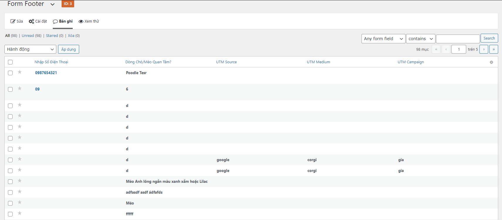
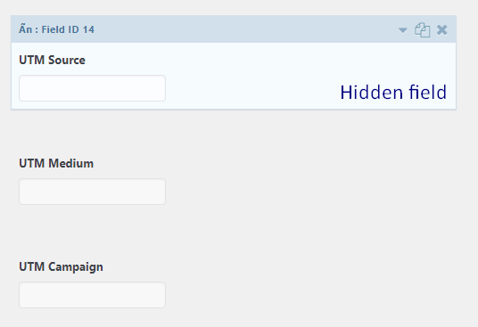
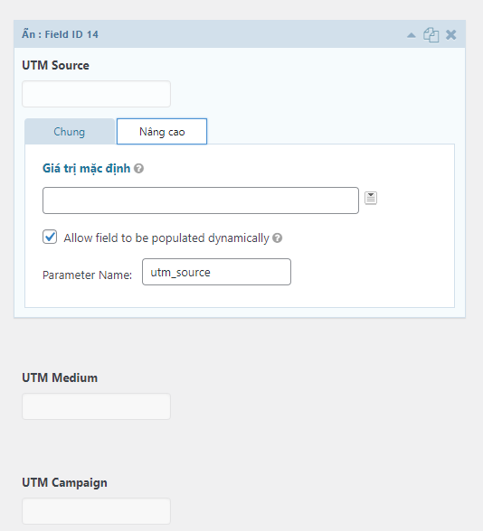

# Code Tot - Gravity Form Tracking

```
Author: CODE TOT JSC
Author URI: https://codetot.com
Developed by Khoi Nguyen - khoi@codetot.com

Please submit bug in case you found to author email.
```

This small plugin helps to detect and save URL attributes as parameters in cookie for sending to entry when user submitted.

## Installation

- In each form editing, add 3 **hidden fields**:

```
UTM Source
UTM Medium
UTM Campaign
```

In each field, please enable "Enable dynamic field population" and set key value as:

```
utm_source
utm_medium
utm_campaign
```

Then activate this plugin.

## Screenshots






